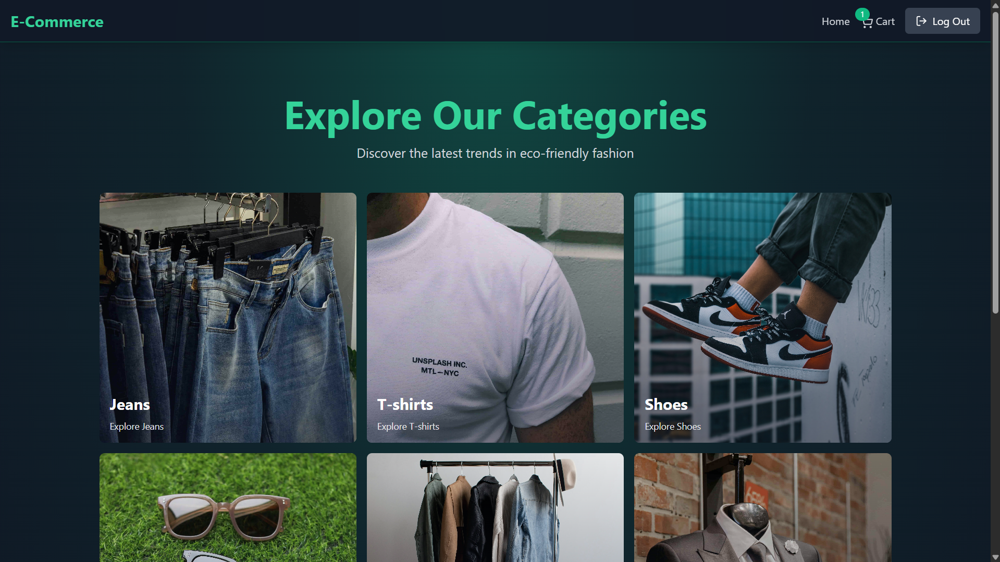
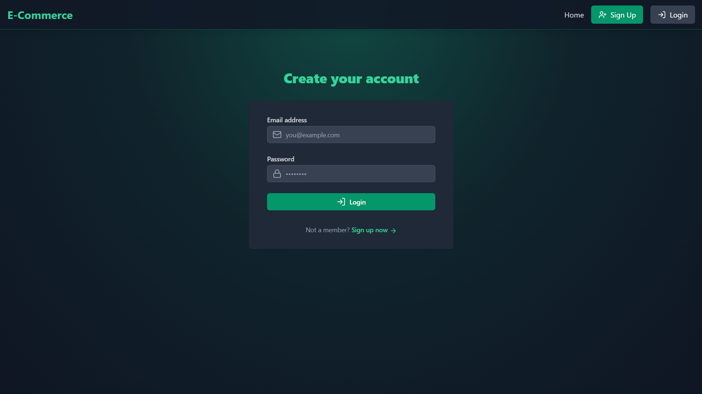
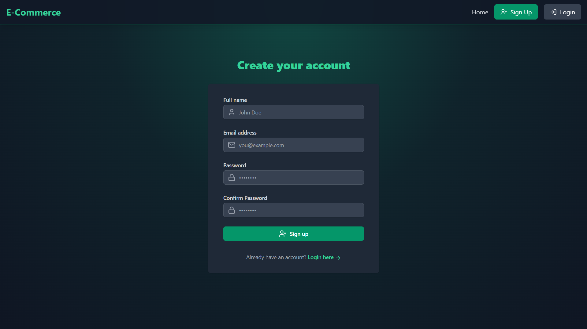
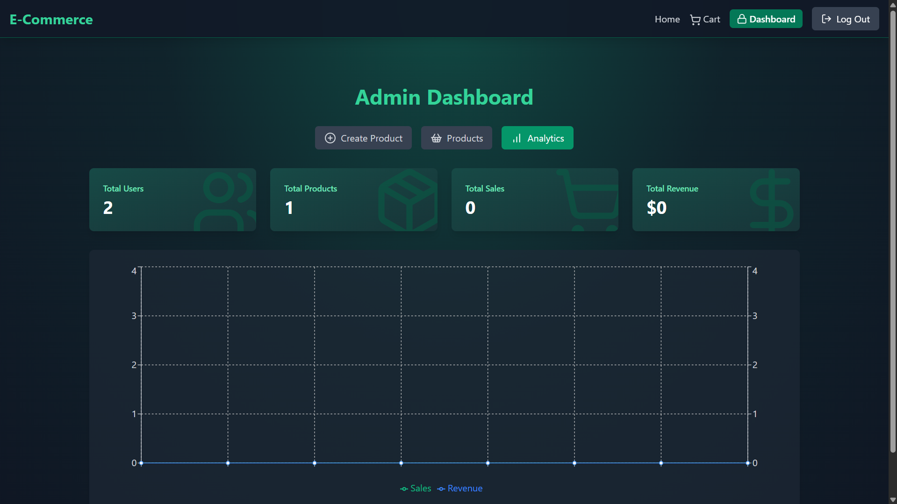
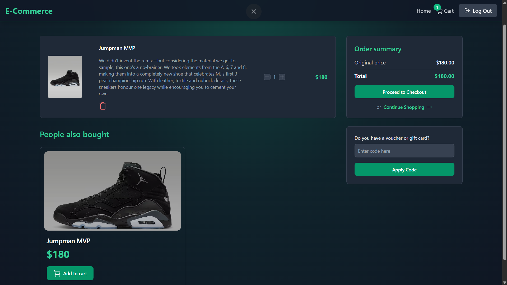
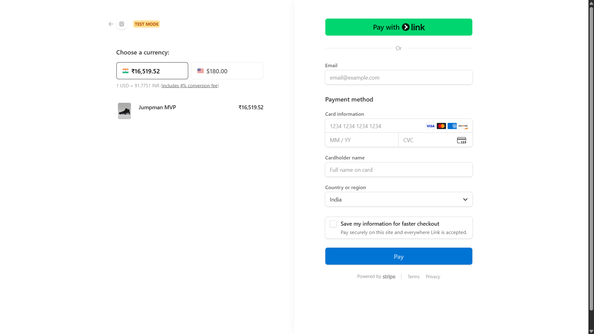

# 🌿 E-Commerce Store

A modern, full-stack e-commerce platform built with the MERN stack (MongoDB, Express, React, Node.js), featuring a beautiful UI, secure authentication, Stripe payments, personalized coupons, and an admin dashboard for analytics and product management.

---

## ✨ Features

- **User Authentication:** Secure signup, login, and JWT-based session management.
- **Product Catalog:** Browse products by category, view featured items, and see recommendations.
- **Shopping Cart:** Add, update, or remove items with real-time cart totals and coupon support.
- **Checkout & Payments:** Seamless Stripe integration for secure payments.
- **Personalized Coupons:** Users receive and apply unique discount codes.
- **Order Management:** Orders are tracked and stored after successful payment.
- **Admin Dashboard:**
  - Create, edit, and delete products.
  - Toggle featured products.
  - View real-time analytics: sales, revenue, users, and more.
- **Responsive UI:** Built with React, Tailwind CSS, and Framer Motion for smooth animations.
- **Performance:** Redis caching for featured products and analytics.

---

## 🛠️ Tech Stack

- **Frontend:** React, Vite, Zustand, React Router, Tailwind CSS, Framer Motion, Lucide Icons
- **Backend:** Node.js, Express, MongoDB (Mongoose), Stripe, Cloudinary, Redis (Upstash)
- **Authentication:** JWT, HTTP-only cookies
- **Payments:** Stripe Checkout
- **Image Uploads:** Cloudinary

---

## 🚀 Getting Started

### Prerequisites

- Node.js & npm
- MongoDB instance
- Stripe account
- Cloudinary account
- Upstash Redis account


```bash

PORT=5000
MONGO_URI=<YOUR_MONGODB_URI>

UPSTASH_REDIS_REST_URL=<YOUR_UPSTASH_REDIS_REST_URL>
UPSTASH_REDIS_REST_TOKEN=<YOUR_UPSTASH_REDIS_REST_TOKEN>

ACCESS_TOKEN_SECRET=<YOUR_ACCESS_TOKEN_SECRET>
REFRESH_TOKEN_SECRET=<YOUR_REFRESH_TOKEN_SECRET>

CLOUDINARY_CLOUD_NAME=<YOUR_CLOUDINARY_CLOUD_NAME>
CLOUDINARY_API_KEY=<YOUR_CLOUDINARY_API_KEY>
CLOUDINARY_API_SECRET=<YOUR_CLOUDINARY_API_SECRET>

STRIPE_SECRET_KEY=<YOUR_STRIPE_SECRET_KEY>

CLIENT_URL=http://localhost:5173
NODE_ENV=development

```

## Screenshots

### Home Page


### Login Page


### Signup Page


### Analytics Page


### Cart Page


### Payment Page

